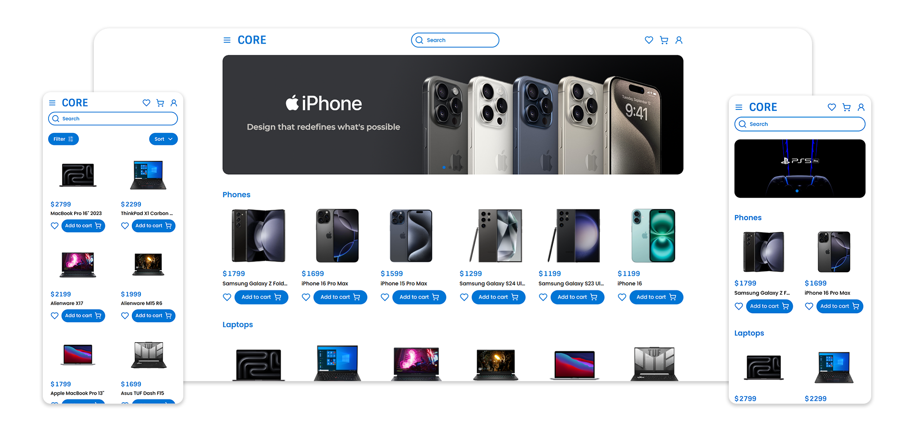
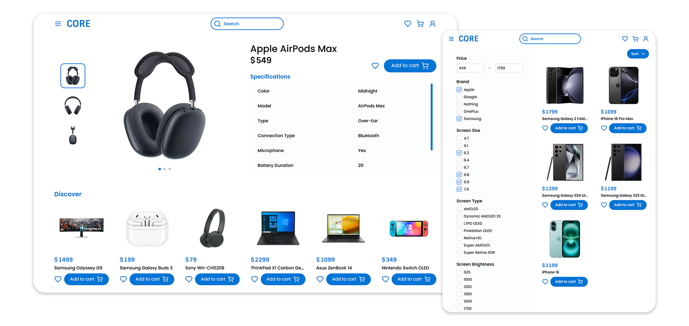

# Core

Core is a full-stack (MERN) e-commerce platform for electronics built with React TypeScript frontend and Express.js backend. The platform offers comprehensive product management, user authentication, shopping cart functionality, and secure PayPal payments.

## Screenshots




## Features

- **User Authentication**: Secure registration and login system with JWT
- **Advanced Product Management**:
  - Browse and search products
  - Dynamic URL query-based filtering processed on the backend
- **Shopping Experience**:
  - Product specifications
  - Cart and wishlist functionality
  - Shipping address management
  - Order placement
  - PayPal payment integration
- **Product Categories**:
  - Phones
  - Tablets
  - Laptops
  - TVs
  - Monitors
  - Gaming Consoles
  - Headphones
- **Admin Dashboard**:
  - User management with role control
  - Category management
  - Product creation and editing with dynamic form
  - Image upload functionality
  - Order management

## Tech Stack

#### Frontend

- React with Vite
- TypeScript
- Tailwind CSS
- Redux Toolkit (State Management)
- RTK Query (API calls)
- Swiper
- React Toastify
- Headless UI

#### Backend

- Express.js
- MongoDB with Mongoose
- JSON Web Tokens (Authentication)
- Formidable (File upload)
- Additional dependencies:
  - bcryptjs (Password hashing)
  - cookie-parser (Cookie handling)
  - cors (Cross-origin resource sharing)

## Prerequisites

- Git
- Node.js v20.18.0
- MongoDB installed locally
- PayPal Developer Account

## Installation Guide

### 1. PayPal Setup

1. Go to [PayPal Developer Dashboard](https://developer.paypal.com/dashboard/)
2. Sign up or log in to your PayPal Developer account
3. Go to "Apps & Credentials"
4. Click "Create App"
   - Choose "Business" as the account type
   - Name your application
   - Select your preferred environment (Sandbox for testing)
5. Once created, you'll see your Client ID
6. Copy the Client ID and add it to your backend `.env` file

Note: Make sure to use the Live Client ID instead of Sandbox ID when deploying to production.

### 2. Clone the Repository

```bash
git clone https://github.com/Sulkhans/Core.git
cd core
```

### 3. Backend Setup

```bash
npm install
```

Create a `.env` file in the root directory:

```env
PORT=5000
MONGO_URI='mongodb://127.0.0.1:27017/core'
CORS_ORIGIN=http://localhost:5173
JWT_SECRET=[ YOUR_JWT_SECRET ]
PAYPAL_CLIENT_ID=[ YOUR_PAYPAL_CLIENT_ID ]
```

Start the backend server:

```bash
npm run backend
```

### 4. Frontend Setup

```bash
cd frontend
npm install
```

Start the frontend development server:

```bash
npm run dev
```

The application will be available at `http://localhost:5173`

## Admin Access Setup

1. Register a new user account through the application
2. Access your MongoDB database
3. Locate the users collection
4. Find your user document
5. Update the `isAdmin` field to `true`

Example MongoDB command:

```javascript
db.users.updateOne(
  { email: "your-email@example.com" },
  { $set: { isAdmin: true } }
);
```

Once set as admin, you can access the admin dashboard and manage other user roles through the UI.

## Development Notes

### Dynamic Filtering System

- Filters are generated automatically based on the products in each category
- Backend processes URL query parameters to filter products
- Example URL: `/category/headphones?page=1&priceMax=400&brand=Sony&type=Over-Ear`

### Product Images

- Images are handled using FormData on the frontend
- Processed using Formidable on the backend
- Supported formats: JPEG, PNG

### API Structure

- User management: `/api/users`
- Category management: `/api/category`
- Product management: `/api/product`
- Image handling: `/api/image`
- Static files: `/uploads`
- Order management: `/api/order`
- PayPal configuration: `/api/config/paypal`
